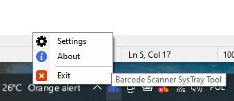
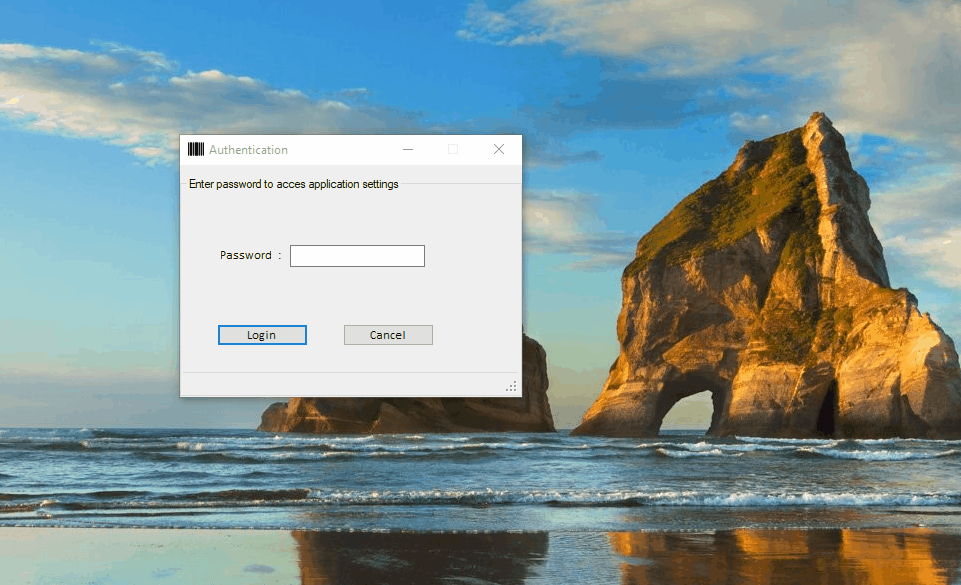

# BarcodeScannerSysTrayTool
Sample Winforms application - for barcode scanner to changing data and perform operations.

## Screenshots

# Microsoft Visual Studio Installer Projects

https://marketplace.visualstudio.com/items?itemName=VisualStudioClient.MicrosoftVisualStudio2017InstallerProjects

OR

# Microsoft Visual Studio Installer Projects Visual Studio 2022
https://marketplace.visualstudio.com/items?itemName=VisualStudioClient.MicrosoftVisualStudio2022InstallerProjects
